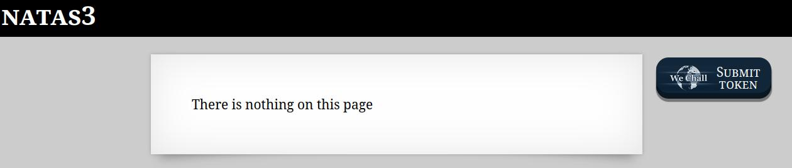
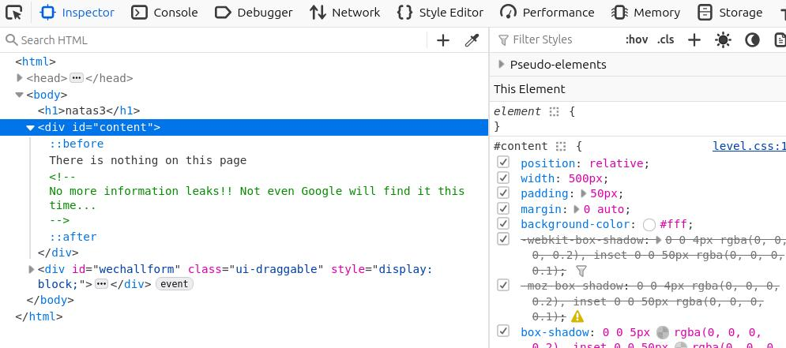
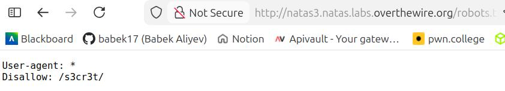
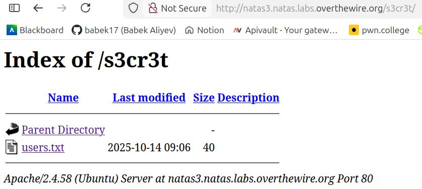
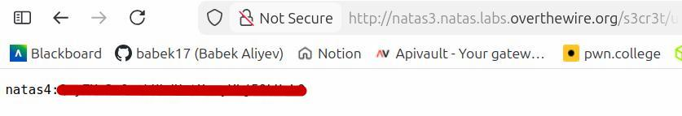

🕵️ Natas Level 3 → Level 4 Walkthrough

The page again displays “There is nothing on this page.”

As always, we dig deeper rather than trusting the visible content.

Inspect the page source

Open Developer Tools (Ctrl + Shift + I)

In the HTML <body> section, we find the comment:

"No more information leaks!! Not even Google will find it this time..."

The comment hints that the site is preventing indexing by search engines. The standard way to do this is with a robots.txt file, which instructs crawlers what they are allowed or blocked from accessing. That's why we need to check robots.txt:

The file contains a Disallow rule for a directory named s3cr3t

Visiting the disallowed directory:

Inside, there is a file named user.txt. After we open user.txt we can retrieve password for natas4:

The password for natas4 is stored here