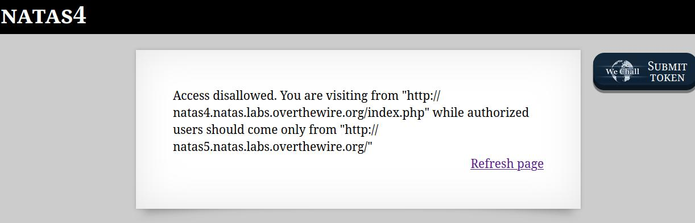
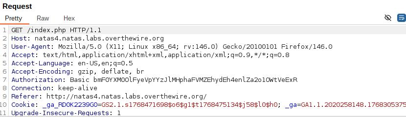

🕵️ Natas Level 4 → Level 5 Walkthrough

Upon accessing the page, the site displays:

This reveals the key requirement:
the application only grants access if the HTTP Referer header indicates the request originated from natas5.natas.labs.overthewire.org.

1. Intercept the request

Enable Burp Suite and turn Intercept ON

Refresh the page so the request appears in Burp

2. Modify the HTTP Referer header

Locate the Referer: line in the request headers

Change it to:

Referer: http://natas5.natas.labs.overthewire.org/

3. Forward the modified request

Send the edited request to the server

The access check passes because the referer now matches the expected origin

4. Retrieve the password

The server responds with the password for natas5