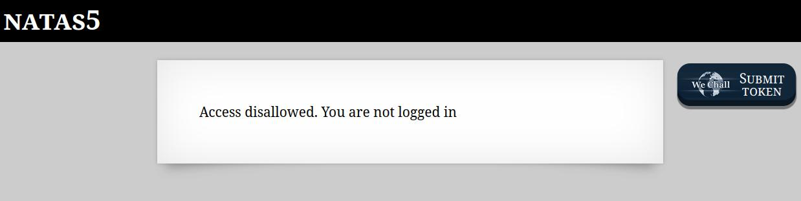
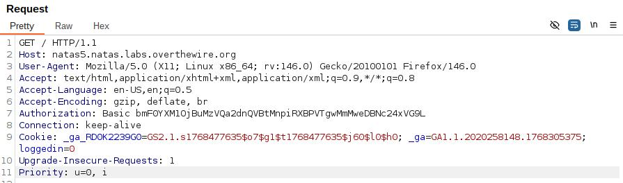
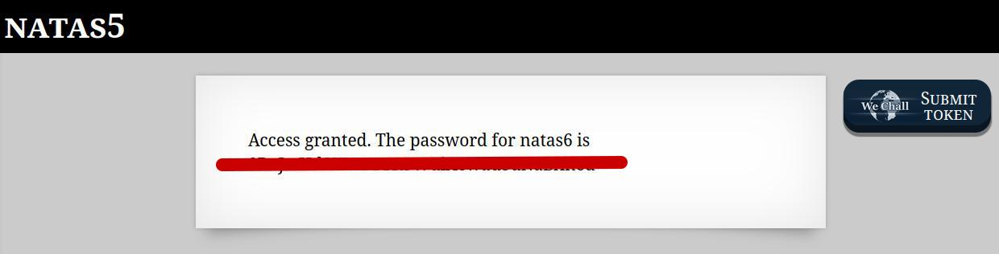

🕵️ Natas Level 5 → Level 6 Walkthrough

Upon accessing the page, the application displays the message:

This indicates that access control is likely enforced using client-side session data.

1. Initial inspection

Inspecting the page source (Ctrl + Shift + I) reveals no useful information

No visible login form or credentials are present

2. Intercept the request with Burp Suite

Open Burp Suite and enable Intercept

Refresh the page to capture the HTTP GET request

3. Analyze cookies

In the intercepted request, the following cookies are observed:

Cookie: _ga_RD0K2239G0=...; _ga=...; loggedin=0

The loggedin cookie is clearly used as a boolean flag for authentication

A value of 0 indicates the user is not logged in

4. Modify authentication state

Change the cookie value from:

loggedin=0

to:

loggedin=1

Forward the modified request

5. Retrieve the password

The server accepts the manipulated cookie

The response reveals the password for natas6