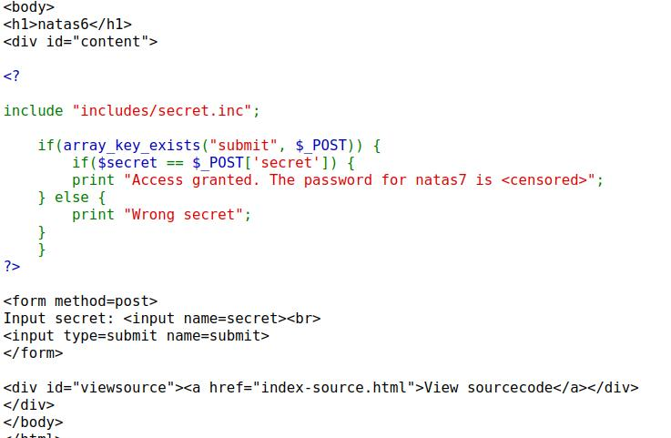
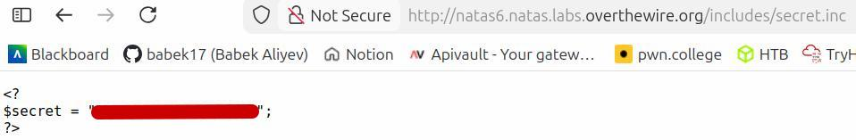
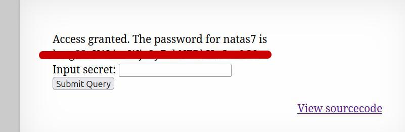

🕵️ Natas Level 6 → Level 7 Walkthrough

This level presents an input field that requires a secret code.
Additionally, there is a “View sourcecode” button available on the page.

1. Review the source code

Click “View sourcecode”

This redirects to a page displaying the PHP source code

Within the code, the following include statement is visible:

include "includes/secret.inc";

2. Identify the hidden file

The include statement reveals the existence of a file:

includes/secret.inc

Since the file is included server-side and not protected, it may be directly accessible

3. Access the secret

Return to the original page

Append the path to the URL:

/includes/secret.inc

The page reveals the secret code

4. Submit the secret

Enter the retrieved secret code into the input field

Submit the form

5. Retrieve the password

The server validates the secret

The password for natas7 is displayed