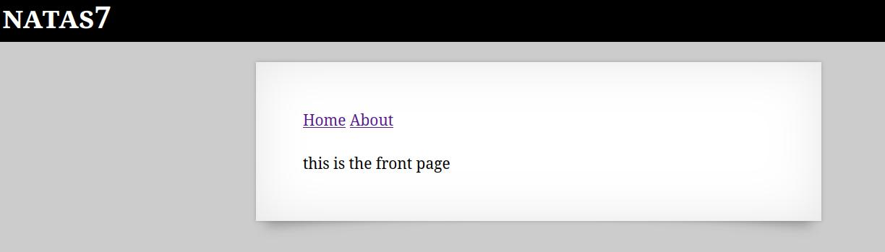
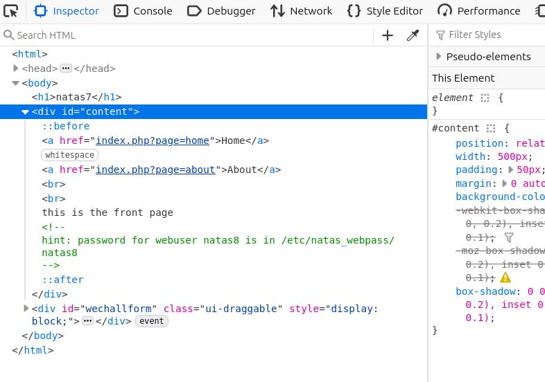
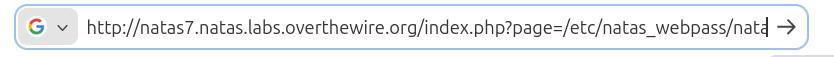

🕵️ Natas Level 7 → Level 8 Walkthrough

Upon entering the page, two navigation links are available: Home and About.
Interacting with these links does not reveal any useful information.

1. Inspect the page source

Open Developer Tools (Ctrl + Shift + I)

In the HTML <body> section, a comment is found:

hint: password for webuser natas8 is in /etc/natas_webpass/natas8

2. Use the disclosed file path

The hint reveals the exact filesystem location of the password

Modify the page parameter in the URL to point to the provided path:

/etc/natas_webpass/natas8

3. Retrieve the password

Accessing the file reveals the password for natas8