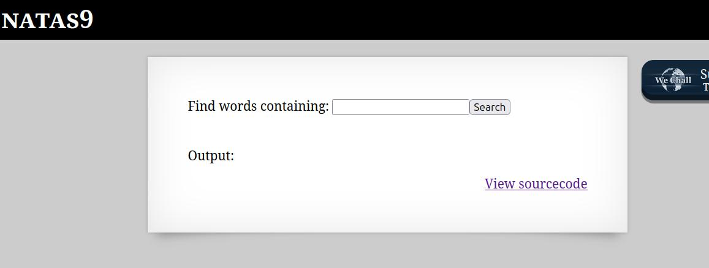
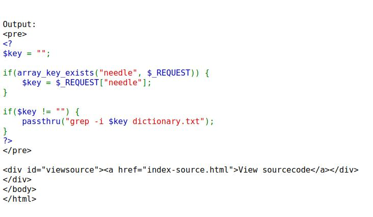
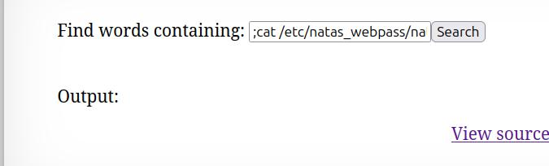
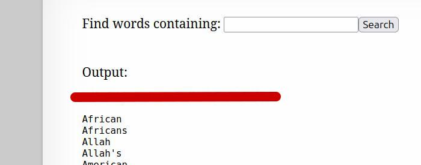

🕵️ Natas Level 9 → Level 10 Walkthrough

The webpage provides a search feature labeled “Find words containing:” with an input field.
At the bottom of the page, there is a “View sourcecode” option.

1. Analyze the source code

Clicking “View sourcecode” reveals the following PHP snippet:

2. Identify the vulnerability

User input ($key) is directly passed into a shell command

No input validation or sanitization is applied

The passthru() function executes the command on the system

This makes the application vulnerable to OS Command Injection.

3. Test command injection

In Linux, a semicolon (;) allows chaining multiple commands.

Input:

;ls

Result:

The server executes ls

Output confirms command execution (e.g., dictionary.txt)

This verifies that command injection is possible.

4. Read sensitive files

In Natas challenges, passwords are stored in:

/etc/natas_webpass/

By injecting the following command:

The cat command reads the password file

The output reveals the password for natas10

Any additional output (such as dictionary.txt) can be ignored