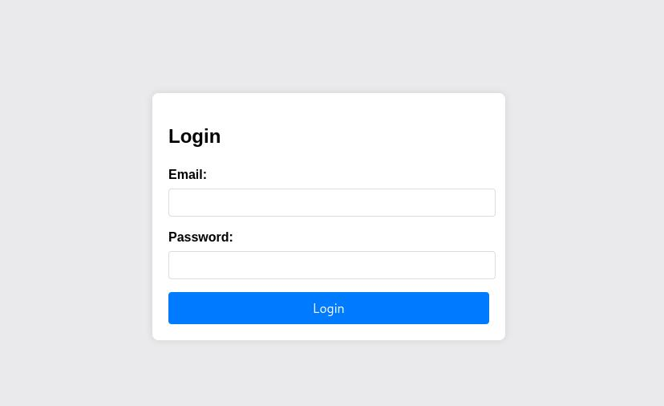
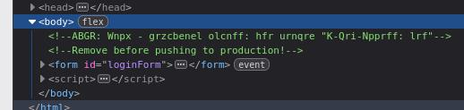
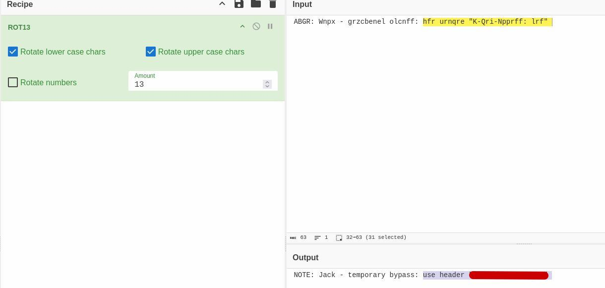
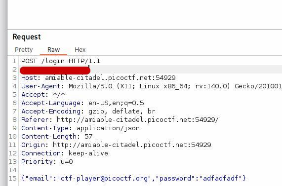
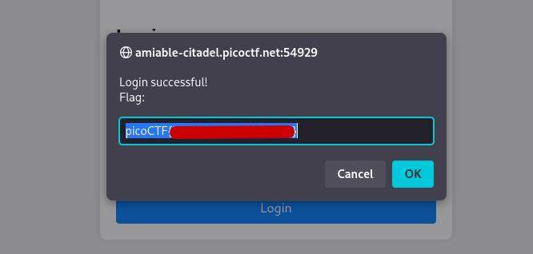

## Solution Walkthrough

After selecting the available link, we are redirected to a login page requiring an email and password. The email field is already known, but no password is provided. The challenge description hints that there may be an alternate way to gain access.

### 1. Inspecting the Web Page
The first step is to inspect the page source. While reviewing the HTML, we discover a block of text commented out. At first glance, it appears to be random characters.

### 2. Decoding the Commented Text
To determine whether the text contains meaningful information, we attempt common encoding transformations. Using CyberChef, we decode the string with **ROT13**, which successfully reveals a hidden hint.

### 3. Modifying the Request in Burp Suite
We intercept the login request using **Burp Suite**.  
In the request editor, we add the required header:

After forwarding the modified POST request, the server accepts it without a password prompt.

### 4. Retrieving the Flag
Once the request succeeds, the application responds with the target flag, completing the challenge.

---

**Key Takeaways**
- Always inspect source code for hidden hints or comments.
- Try common decoding schemes (e.g., ROT13) when encountering obfuscated text.
- Custom request headers may provide access mechanisms during testing.
- Burp Suite is a powerful tool for request interception and modification.
