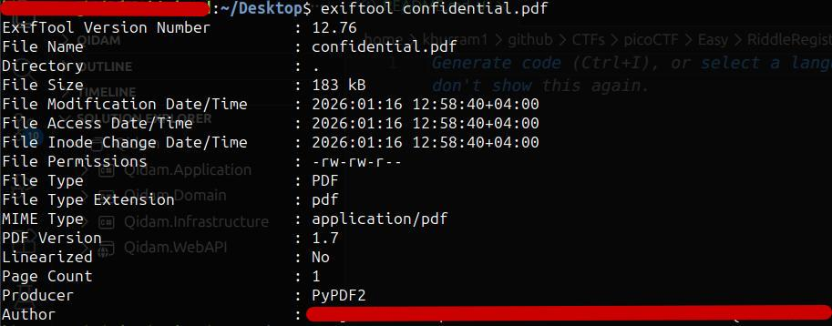
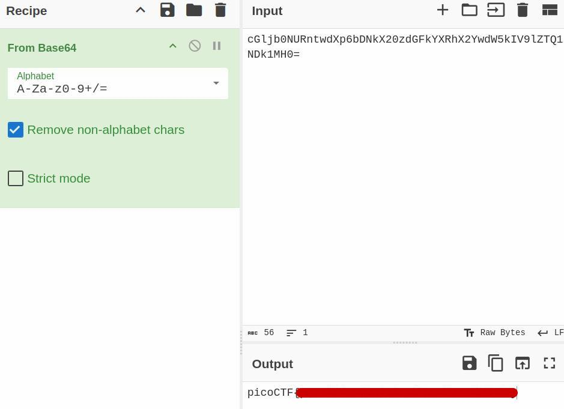

# picoCTF – Riddle Registry

## Challenge Overview
The **Riddle Registry** challenge provides a PDF file and hints that the flag is hidden within the file’s **metadata**. The goal is to analyze the PDF beyond its visible content to uncover the encoded flag.

---

## Initial Inspection
Opening the PDF normally does not reveal the flag. However, closer inspection shows that the document contains **hidden text**, which can be observed by:

- Inspecting the PDF using browser developer tools
- Copying and pasting the entire content of the document

The extracted text appears unreadable and does not immediately resemble a flag.

---

## Failed Encoding Attempts
Several common encoding techniques were tested on the hidden text, including:

- ROT13  
- ROT47  

These methods did not produce any meaningful output or flag.

---

## Metadata Analysis
Based on the challenge description hinting at metadata, the PDF file was analyzed using `exiftool`, a tool commonly used to inspect file metadata.

```bash
exiftool confidential.pdf
```



The output revealed standard metadata fields such as: PDF Version, producer, author

Decoding the Flag

The value found in the Author field resembles Base64 encoding. Decoding it using a tool such as CyberChef or base64 reveals the flag.

