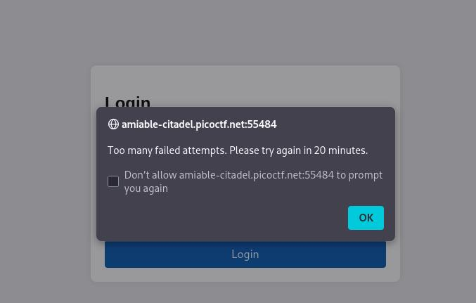
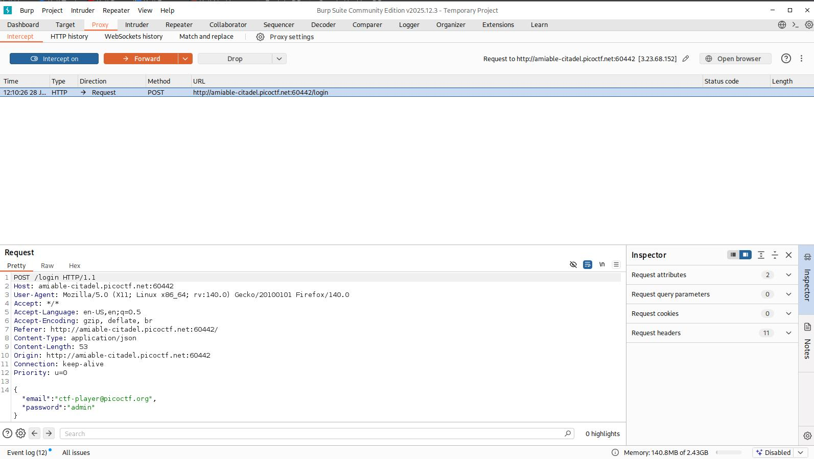
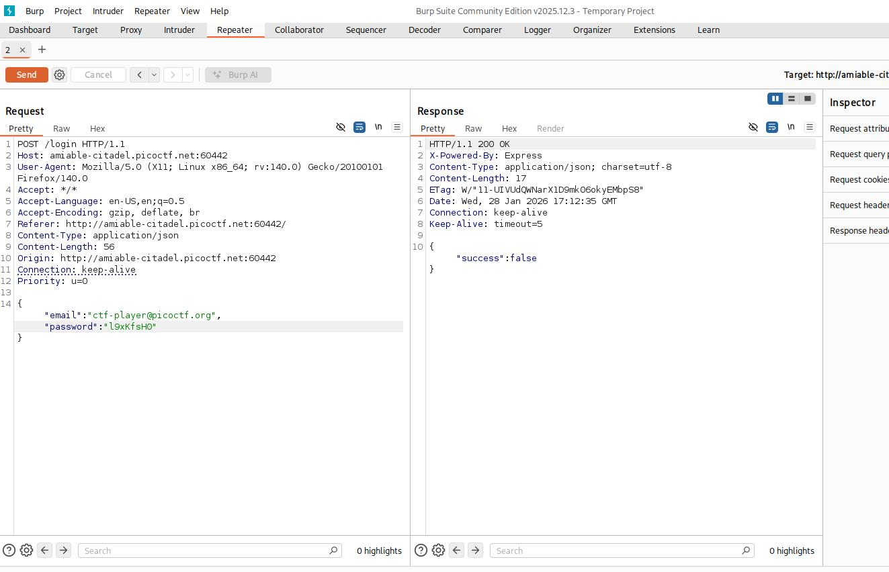
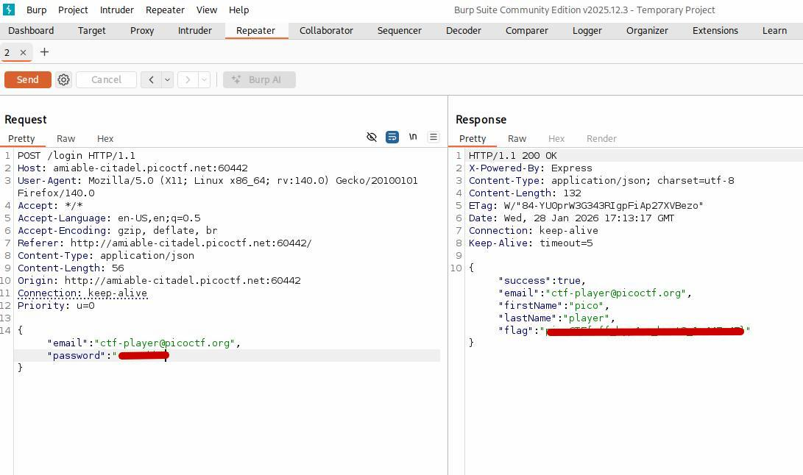

# Crack The Gate 2 | picoCTF

## Description

The login system has been upgraded with a basic rate-limiting mechanism that locks out repeated failed attempts from the same source. We’ve received a tip that the system might still trust user-controlled headers. Your objective is to bypass the rate-limiting restriction and log in using the known email address: ctf-player@picoctf.org and uncover the hidden secret.

## Analysis

At first I tried to inspect the page to find potential hints for this CTF but there was nothing. Then, then I tried to enter some random password for user `ctf-player@picoctf.org` to see the output. After wrong password we get output saying wrong credentials and that we have to wait for 20 minutes:

After seeing this output I opened **Burp Suite** to see the request we are sending:

As you can see there is nothing special in this section. At this moment I though that I can use Burp Suite Repeater to bypass this "20 minutes" limit. All we need to do is to capture the request using Interception. After capturing the request, we need to right click to it, and choose option "Send to Repeater". Now we need to switch to Repeater tab on the top.

## Solution
After switching to Repeater tab, we can send as many requests as we want. Because our `passwords.txt` file consists only of 20 passwords, we can just type manually them to find the correct one:

This is the first "Send". Now all we need to do is to find the correct one:

That's it. We solved the current CTF!
